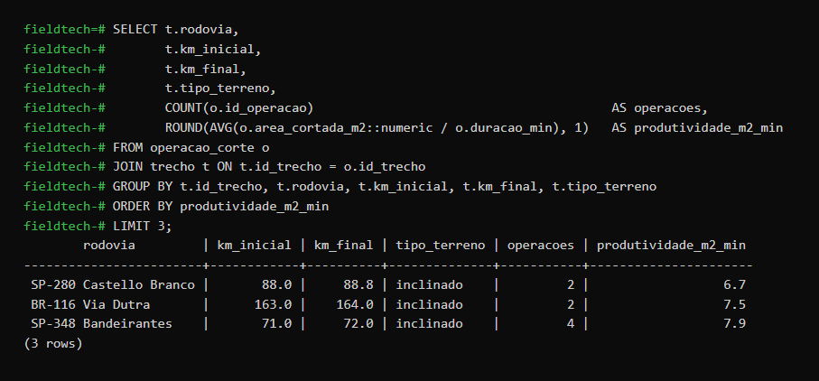
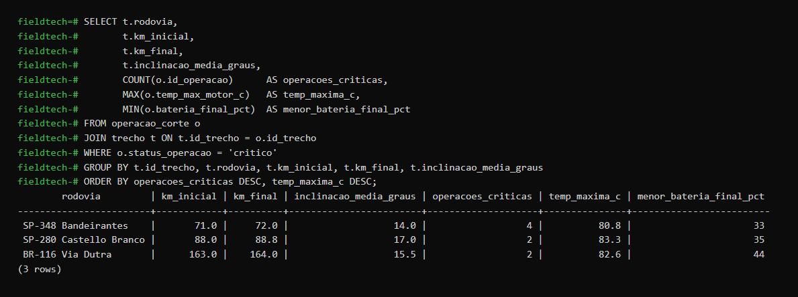
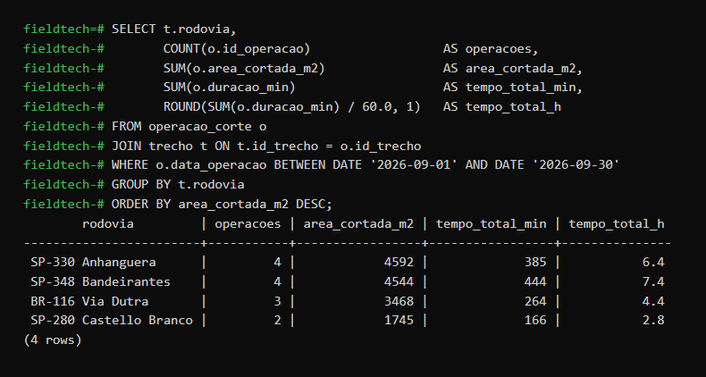
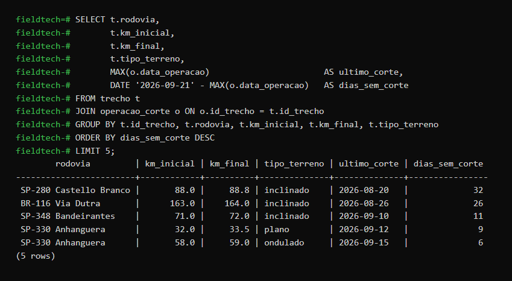
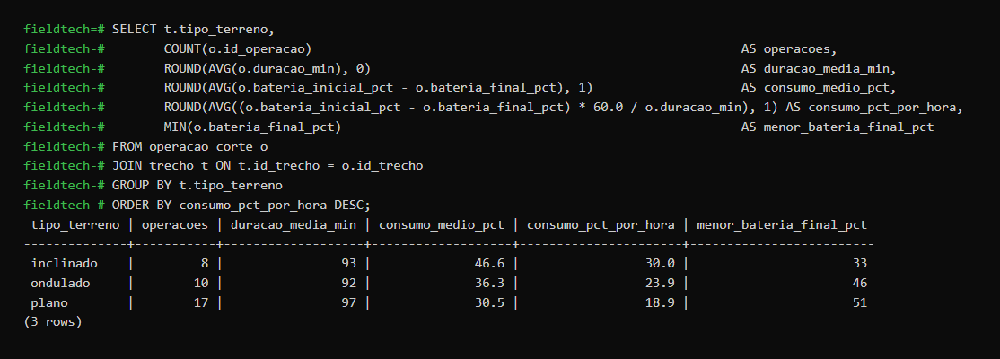

# FieldTech Engineering Challenge – Sprint 3

**SQL aplicado ao Challenge MOTIVA / CCR – Data Science for Engineers (FIAP, Engenharia Mecatrônica)**

## Integrantes

| Nome | RM |
|---|---|
| Christopher Takeuti | 563318 |
| Erick Lima | 565268 |
| Luiz Henrique de Almeida | 564390 |
| Mateus Bustamante | 564021 |
| Pedro Lopes | 565575 |

## 1. Contexto do projeto

A MOTIVA (CCR) administra rodovias como a Anhanguera, a Bandeirantes, a Castello Branco e a Via Dutra. Uma das obrigações da concessionária é manter a vegetação da faixa de domínio sempre roçada: mato alto compromete a visibilidade, a drenagem e a segurança dos usuários, e o intervalo entre cortes é fiscalizado pela agência reguladora.

A solução do grupo é um **robô cortador de grama autônomo** que roça a faixa lateral da rodovia sem expor uma equipe ao tráfego. O robô registra, a cada operação, quanto cortou, quanto tempo levou, quanto de bateria gastou, a temperatura do motor e a condição da grama.

Nesta Sprint esses registros foram organizados em um banco PostgreSQL com duas tabelas relacionadas, e cinco consultas SQL respondem perguntas que a concessionária precisa fazer para operar o robô: onde ele rende menos, onde ele está superaquecendo, quanto foi cortado no mês, o que precisa ser cortado primeiro e quanto de bateria cada tipo de terreno consome.

Os dados são simulados, mas coerentes com o robô: um cortador com faixa de corte de cerca de 0,9 m, velocidade abaixo de 1 km/h, produtividade entre 6 e 15 m²/min conforme o terreno, motor com limite térmico de 70 °C e bateria que dura entre 3 e 5 horas de trabalho.

## 2. Estrutura do repositório

```
fieldtech-sprint3/
├── README.md                 # este documento
├── fieldtech_sprint3.sql     # criação das tabelas, carga dos dados e as 5 consultas comentadas
├── dados/
│   ├── trechos.csv           # 8 trechos de rodovia (mesmos dados dos INSERTs)
│   └── operacoes.csv         # 35 operações de corte do robô (mesmos dados dos INSERTs)
├── prints/
│   └── consulta1.png ... consulta5.png   # print de cada consulta executada com o resultado
└── entrega_portal.txt        # arquivo enviado no portal (nomes, RMs e link do repositório)
```

## 3. Estrutura do banco de dados

Duas tabelas com relacionamento **1 : N** – um trecho de rodovia recebe várias operações de corte.

```
trecho (1) ───────< operacao_corte (N)
id_trecho PK          id_trecho FK
```

### Tabela `trecho` – trechos de rodovia em que o robô faz a roçada

| Coluna | Tipo | Descrição |
|---|---|---|
| id_trecho | INTEGER **PK** | identificador do trecho |
| rodovia | VARCHAR(40) | rodovia (ex.: SP-330 Anhanguera) |
| km_inicial | NUMERIC(6,1) | km de início do trecho |
| km_final | NUMERIC(6,1) | km de fim do trecho |
| sentido | VARCHAR(10) | sentido da pista |
| tipo_terreno | VARCHAR(10) | plano, ondulado ou inclinado |
| inclinacao_media_graus | NUMERIC(4,1) | inclinação média do talude |
| area_m2 | INTEGER | área da faixa a roçar (3 m de largura × extensão) |

### Tabela `operacao_corte` – cada operação executada pelo robô

| Coluna | Tipo | Descrição |
|---|---|---|
| id_operacao | INTEGER **PK** | identificador da operação |
| id_trecho | INTEGER **FK → trecho** | trecho em que o robô trabalhou |
| data_operacao | DATE | data da operação |
| duracao_min | INTEGER | duração da operação em minutos |
| area_cortada_m2 | INTEGER | área efetivamente cortada |
| bateria_inicial_pct | INTEGER | carga da bateria no início (%) |
| bateria_final_pct | INTEGER | carga da bateria no fim (%) |
| temp_max_motor_c | NUMERIC(4,1) | temperatura máxima do motor de corte (°C) |
| umidade_grama_pct | INTEGER | umidade da grama (%) |
| velocidade_media_kmh | NUMERIC(4,2) | velocidade média de deslocamento |
| status_operacao | VARCHAR(10) | normal, atencao ou critico (critico = motor acima de 70 °C ou bateria abaixo de 20 %) |

Volume de dados: **8 trechos** em 4 rodovias e **35 operações** entre 03/08/2026 e 18/09/2026.

### Como reproduzir

```bash
createdb fieldtech
psql -d fieldtech -f fieldtech_sprint3.sql
```

O arquivo `.sql` cria as tabelas, carrega os dados com `INSERT INTO` e executa as cinco consultas. Os mesmos dados estão em `dados/*.csv` para quem preferir importar com `\copy trecho FROM 'dados/trechos.csv' CSV HEADER` e `\copy operacao_corte FROM 'dados/operacoes.csv' CSV HEADER`.

## 4. Perguntas, consultas, resultados e interpretações

### Consulta 1 – Em quais trechos o robô rende menos?

**Pergunta:** Em quais trechos o robô tem a menor produtividade média (m² cortados por minuto)?



```sql
SELECT t.rodovia,
       t.km_inicial,
       t.km_final,
       t.tipo_terreno,
       COUNT(o.id_operacao)                                        AS operacoes,
       ROUND(AVG(o.area_cortada_m2::numeric / o.duracao_min), 1)   AS produtividade_m2_min
FROM operacao_corte o
JOIN trecho t ON t.id_trecho = o.id_trecho
GROUP BY t.id_trecho, t.rodovia, t.km_inicial, t.km_final, t.tipo_terreno
ORDER BY produtividade_m2_min
LIMIT 3;
```

**Resultado:**

| rodovia | km_inicial | km_final | tipo_terreno | operacoes | produtividade_m2_min |
|---|---:|---:|---|---:|---:|
| SP-280 Castello Branco | 88.0 | 88.8 | inclinado | 2 | 6.7 |
| BR-116 Via Dutra | 163.0 | 164.0 | inclinado | 2 | 7.5 |
| SP-348 Bandeirantes | 71.0 | 72.0 | inclinado | 4 | 7.9 |

**Interpretação:** os três trechos de pior rendimento são todos de terreno inclinado, com produtividade em torno de 7 m²/min, contra cerca de 13 m²/min nos trechos planos. Com esse número a concessionária consegue dimensionar quantas horas de robô cada trecho exige e decidir se os taludes mais íngremes continuam com o robô, recebem um robô configurado para inclinação ou ficam com a equipe manual.

### Consulta 2 – Onde o robô está operando em condição crítica?

**Pergunta:** Em quais trechos o robô teve operações críticas (superaquecimento ou bateria no limite), quantas foram e qual a temperatura máxima registrada?



```sql
SELECT t.rodovia,
       t.km_inicial,
       t.km_final,
       t.inclinacao_media_graus,
       COUNT(o.id_operacao)      AS operacoes_criticas,
       MAX(o.temp_max_motor_c)   AS temp_maxima_c,
       MIN(o.bateria_final_pct)  AS menor_bateria_final_pct
FROM operacao_corte o
JOIN trecho t ON t.id_trecho = o.id_trecho
WHERE o.status_operacao = 'critico'
GROUP BY t.id_trecho, t.rodovia, t.km_inicial, t.km_final, t.inclinacao_media_graus
ORDER BY operacoes_criticas DESC, temp_maxima_c DESC;
```

**Resultado:**

| rodovia | km_inicial | km_final | inclinacao_media_graus | operacoes_criticas | temp_maxima_c | menor_bateria_final_pct |
|---|---:|---:|---:|---:|---:|---:|
| SP-348 Bandeirantes | 71.0 | 72.0 | 14.0 | 4 | 80.8 | 33 |
| SP-280 Castello Branco | 88.0 | 88.8 | 17.0 | 2 | 83.3 | 35 |
| BR-116 Via Dutra | 163.0 | 164.0 | 15.5 | 2 | 82.6 | 44 |

**Interpretação:** todas as operações críticas aconteceram nos três trechos com inclinação acima de 14°, e nos três a temperatura máxima do motor passou dos 80 °C, bem acima do limite de 70 °C. No trecho da Bandeirantes as 4 operações realizadas foram críticas. Isso orienta a manutenção e a programação: nesses trechos o robô deve trabalhar nas horas mais frescas, em operações mais curtas, e o motor de corte precisa de inspeção antes que uma falha deixe o equipamento parado na beira da pista.

### Consulta 3 – Quanto foi cortado em cada rodovia em setembro?

**Pergunta:** Quanta área o robô cortou em cada rodovia em setembro de 2026 e quantas horas de operação isso exigiu?



```sql
SELECT t.rodovia,
       COUNT(o.id_operacao)                  AS operacoes,
       SUM(o.area_cortada_m2)                AS area_cortada_m2,
       SUM(o.duracao_min)                    AS tempo_total_min,
       ROUND(SUM(o.duracao_min) / 60.0, 1)   AS tempo_total_h
FROM operacao_corte o
JOIN trecho t ON t.id_trecho = o.id_trecho
WHERE o.data_operacao BETWEEN DATE '2026-09-01' AND DATE '2026-09-30'
GROUP BY t.rodovia
ORDER BY area_cortada_m2 DESC;
```

**Resultado:**

| rodovia | operacoes | area_cortada_m2 | tempo_total_min | tempo_total_h |
|---|---:|---:|---:|---:|
| SP-330 Anhanguera | 4 | 4592 | 385 | 6.4 |
| SP-348 Bandeirantes | 4 | 4544 | 444 | 7.4 |
| BR-116 Via Dutra | 3 | 3468 | 264 | 4.4 |
| SP-280 Castello Branco | 2 | 1745 | 166 | 2.8 |

**Interpretação:** é o relatório mensal de produção do robô por rodovia. A concessionária usa esse número para comprovar o serviço executado à agência reguladora, comparar o custo da hora de robô com o custo da equipe manual e perceber desequilíbrios: em setembro a Castello Branco recebeu menos da metade da área cortada na Anhanguera, com apenas duas operações.

### Consulta 4 – O que precisa ser cortado primeiro?

**Pergunta:** Quais trechos estão há mais tempo sem corte e devem entrar primeiro na próxima programação do robô? (data de referência: 21/09/2026)



```sql
SELECT t.rodovia,
       t.km_inicial,
       t.km_final,
       t.tipo_terreno,
       MAX(o.data_operacao)                       AS ultimo_corte,
       DATE '2026-09-21' - MAX(o.data_operacao)   AS dias_sem_corte
FROM trecho t
JOIN operacao_corte o ON o.id_trecho = t.id_trecho
GROUP BY t.id_trecho, t.rodovia, t.km_inicial, t.km_final, t.tipo_terreno
ORDER BY dias_sem_corte DESC
LIMIT 5;
```

**Resultado:**

| rodovia | km_inicial | km_final | tipo_terreno | ultimo_corte | dias_sem_corte |
|---|---:|---:|---|---|---:|
| SP-280 Castello Branco | 88.0 | 88.8 | inclinado | 2026-08-20 | 32 |
| BR-116 Via Dutra | 163.0 | 164.0 | inclinado | 2026-08-26 | 26 |
| SP-348 Bandeirantes | 71.0 | 72.0 | inclinado | 2026-09-10 | 11 |
| SP-330 Anhanguera | 32.0 | 33.5 | plano | 2026-09-12 | 9 |
| SP-330 Anhanguera | 58.0 | 59.0 | ondulado | 2026-09-15 | 6 |

**Interpretação:** dois trechos estão há mais de 25 dias sem corte, e os dois são inclinados, justamente onde o robô rende menos e superaquece. A consulta entrega a fila de prioridade da semana: o km 88 da Castello Branco e o km 163 da Dutra precisam ser roçados primeiro, antes que a vegetação ultrapasse a altura permitida e a concessionária seja penalizada.

### Consulta 5 – Quanto de bateria cada tipo de terreno consome?

**Pergunta:** Quanto de bateria o robô gasta em cada tipo de terreno? Uma carga é suficiente para uma operação completa?



```sql
SELECT t.tipo_terreno,
       COUNT(o.id_operacao)                                                          AS operacoes,
       ROUND(AVG(o.duracao_min), 0)                                                  AS duracao_media_min,
       ROUND(AVG(o.bateria_inicial_pct - o.bateria_final_pct), 1)                    AS consumo_medio_pct,
       ROUND(AVG((o.bateria_inicial_pct - o.bateria_final_pct) * 60.0 / o.duracao_min), 1) AS consumo_pct_por_hora,
       MIN(o.bateria_final_pct)                                                      AS menor_bateria_final_pct
FROM operacao_corte o
JOIN trecho t ON t.id_trecho = o.id_trecho
GROUP BY t.tipo_terreno
ORDER BY consumo_pct_por_hora DESC;
```

**Resultado:**

| tipo_terreno | operacoes | duracao_media_min | consumo_medio_pct | consumo_pct_por_hora | menor_bateria_final_pct |
|---|---:|---:|---:|---:|---:|
| inclinado | 8 | 93 | 46.6 | 30.0 | 33 |
| ondulado | 10 | 92 | 36.3 | 23.9 | 46 |
| plano | 17 | 97 | 30.5 | 18.9 | 51 |

**Interpretação:** em terreno inclinado o robô gasta 30 % da bateria por hora, contra 19 % no plano. Uma carga completa rende cerca de 3 h de trabalho no talude e mais de 5 h no plano. Com isso a concessionária define a duração máxima de cada operação por tipo de terreno, decide onde posicionar a base de recarga e se os trechos inclinados exigem uma segunda bateria, evitando que o robô pare sem carga no meio da faixa da rodovia.

## 5. Conceitos SQL utilizados

| Conceito | Consultas |
|---|---|
| WHERE | 2, 3 |
| ORDER BY | 1, 2, 3, 4, 5 |
| LIMIT | 1, 4 |
| COUNT | 1, 2, 3, 5 |
| AVG | 1, 5 |
| MIN | 2, 5 |
| MAX | 2, 4 |
| SUM | 3 |
| GROUP BY | 1, 2, 3, 4, 5 |
| JOIN | 1, 2, 3, 4, 5 |
| CREATE TABLE, PRIMARY KEY, FOREIGN KEY, INSERT INTO | fieldtech_sprint3.sql |
